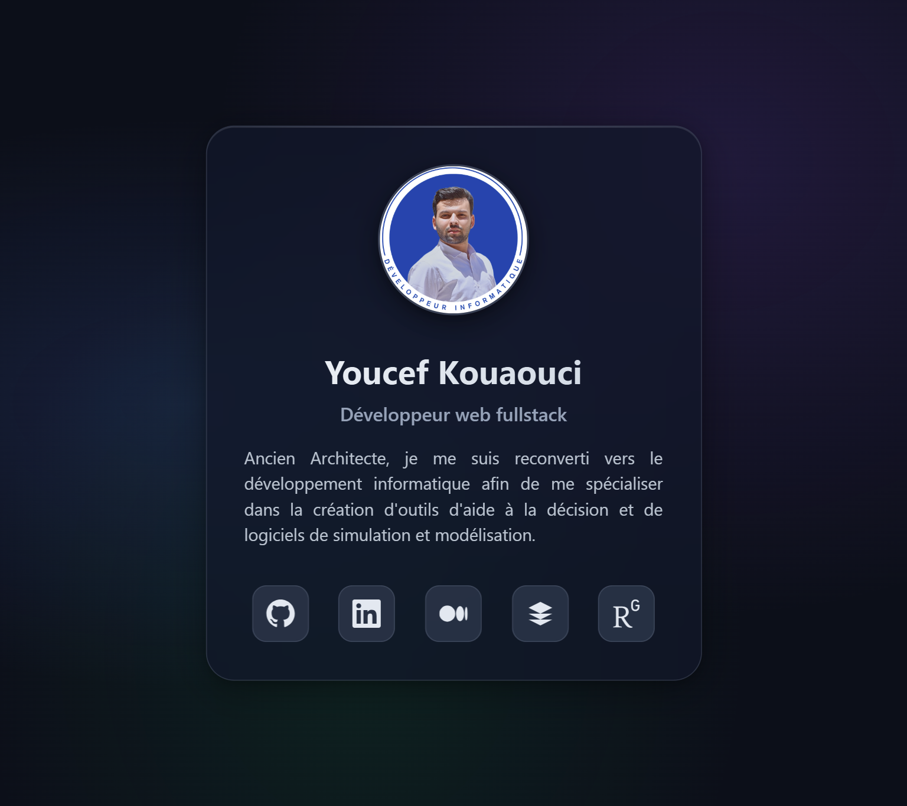

# Carte de liens — Youcef Kouaouci

Mini page de présentation accessible via le QR code de mon CV.

🔗 **[links.youcefkouaouci.dev](https://links.youcefkouaouci.dev)**

## Stack

- HTML5 sémantique
- CSS natif (nesting, variables)
- Vite

## Profils

| Réseau       | Lien                                                                                          |
| ------------ | --------------------------------------------------------------------------------------------- |
| GitHub       | [Youcefkouaouci](https://github.com/Youcefkouaouci)                                           |
| LinkedIn     | [youcef-kouaouci](https://www.linkedin.com/in/youcef-kouaouci/)                               |
| Medium       | [@youcefkouaouci7](https://medium.com/@youcefkouaouci7)                                       |
| roadmap.sh   | [youcefkouaouci](https://roadmap.sh/u/youcefkouaouci)                                         |
| ResearchGate | [Youcef-Dhia-Elhak-Kouaouci](https://www.researchgate.net/profile/Youcef-Dhia-Elhak-Kouaouci) |

---

Projet personnel — page ultra-simple pour centraliser mes réseaux pro.
